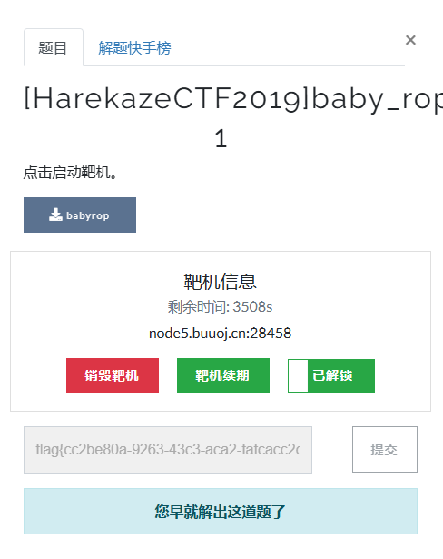

# pwn 动态链接和ret2libc

## 资源

[ppt课件](/pwn/lesson-3-source/lesson_3.pptx)

[代码](/pwn/lesson-3-source/code.zip)

## got plt

got表存放函数真实地址。got表可修改。调用库函数**等价**调用plt。

plt表为函数读取并执行got表所储存地址的代码段。plt不可修改。

### got的3种利用方式

1. 泄露libc地址
2. 修改got表劫持函数。
3. 泄露程序地址（启动PIE）

### libc查找函数

1. 使用LibcSearcher查找（未知libc）
2. 使用pwntools的ELF读取现有libc文件。

泄露某个函数的真实地址（libc地址）后计算libc基址，然后可以推算system函数和`"/bin/sh"`的地址。

## 格式化字符串概念

`%n`：可往对应**参数所指向地址**写入。写入已输出字符数。

`$`: 可实现任意位置参数操作。如`%8$d`为以32位整型输出第9个参数的内容。

| 格式化符号 | 操作      |
| ---------- | --------- |
| `%n`       | 写入4字节 |
| `%hn`      | 写入2字节 |
| `%hhn`     | 写入1字节 |

### 利用

1. 任意地址写，如修改got表，修改全局变量。
2. 泄露栈上任意内容，包括libc地址，程序地址，栈地址。

### buf位置

1. 栈上，即本文（本节课）所讲，一般而言较简单。
2. 非栈上。无法修改栈上内容，即无法修改后续参数值，需要利用跳板，一般而言较困难且复杂。参考[浅谈非栈上格式化字符串 - Kee02p - 博客园 (cnblogs.com)](https://www.cnblogs.com/w0lf-KP/p/17608654.html)

## 作业

注册[BUUCTF在线评测 (buuoj.cn)](https://buuoj.cn/)，然后做题。

[wdb_2018_2nd_easyfmt](https://buuoj.cn/challenges#wdb_2018_2nd_easyfmt)

[wdb_2018_3rd_soEasy](https://buuoj.cn/challenges#wdb_2018_3rd_soEasy)

[x_ctf_b0verfl0w](https://buuoj.cn/challenges#x_ctf_b0verfl0w)

[护网杯_2018_gettingstart](https://buuoj.cn/challenges#护网杯_2018_gettingstart)

[actf_2019_babystack](https://buuoj.cn/challenges#actf_2019_babystack)

建议多做一些，练一练。包括前面讲的shellcode之类的也练了。可以都写wp，写了我都乐意看。

做完写wp，wp附答题完成截图。ppt中的思考题可一并放入。ddl为8月14号。然后pdf发邮箱waltchans@163.com。

截图如下。截初次解出的答题成功也行。

